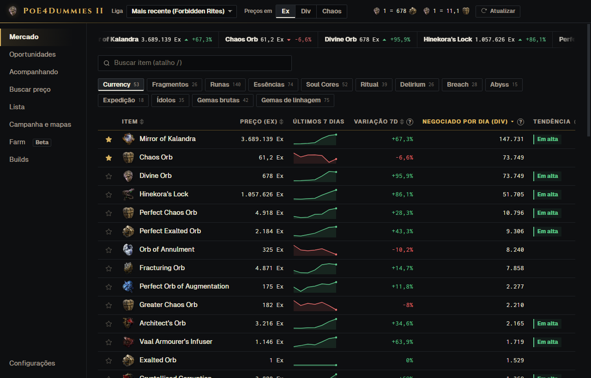
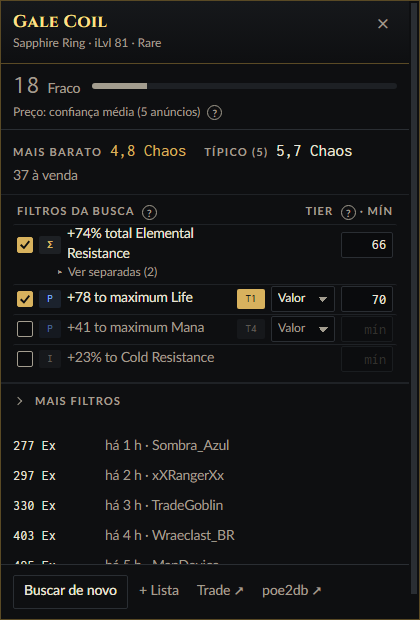
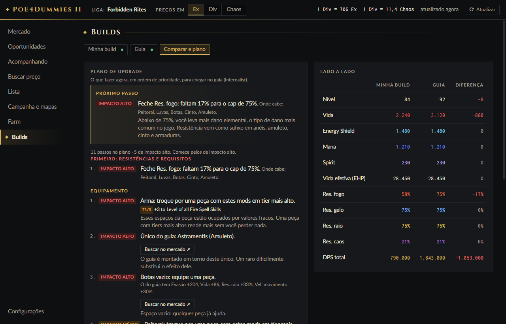
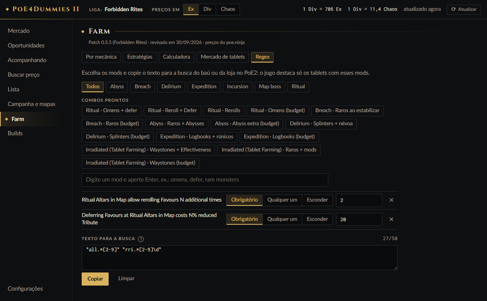

# PoE4Dummies II

Preços, price check e guia de campanha para **Path of Exile 2**, num app só, pensado para quem está começando ou joga casual.

## ⬇️ Baixar

[-d8b25e?style=for-the-badge&logo=windows&logoColor=white)](https://github.com/luanguedes00/poe4dummies/releases/download/v0.2.0/PoE4Dummies-II-0.2.0-setup.exe)
&nbsp;
[-555?style=for-the-badge&logo=windows&logoColor=white)](https://github.com/luanguedes00/poe4dummies/releases/download/v0.2.0/PoE4Dummies-II-0.2.0-portable.exe)

1. Clique em um dos botões acima. O download começa na hora (cerca de 100 MB).
2. Abra o arquivo baixado.
3. Se aparecer "O Windows protegeu o computador", clique em **Mais informações → Executar assim mesmo**. O aviso aparece porque o app não tem assinatura digital paga.

Versão atual: **0.2.0**. Todas as versões ficam em [Releases](https://github.com/luanguedes00/poe4dummies/releases).

*Prices, price check and campaign helper for Path of Exile 2, in one app, made for new and casual players. English summary at the end.*

> **Projeto feito em vibe coding.** O código foi escrito com IA (Claude, da Anthropic). A ideia, as decisões e os testes no jogo são do autor.
> *Vibe-coded project: the code was written with AI (Anthropic's Claude), with direction and in-game testing by the author.*



## Qual baixar

| Arquivo | Para quem |
|---|---|
| `PoE4Dummies-II-<versão>-setup.exe` | **Instalável.** Cria atalhos na Área de Trabalho e no Menu Iniciar e aparece em "Adicionar ou remover programas". Não pede administrador. |
| `PoE4Dummies-II-<versão>-portable.exe` | **Portátil.** Não instala nada: é só abrir. |

As duas usam as mesmas configurações. Desinstalar não apaga as configurações nem o cache.

**Requisitos:** Windows 10 ou 11, jogo em **inglês** e PoE2 em **Windowed Fullscreen**, para a sobreposição aparecer por cima do jogo. A interface do app é em português ou inglês.

## O que ele faz

| | |
|---|---|
| **Mercado** | Preço de todas as categorias do poe.ninja em Exalted, Divine ou Chaos, com gráfico, médias e "momento de compra". |
| **Price check no jogo** | `Ctrl+C` em um item com o jogo em foco: preço, nota do item, tier de cada mod e filtros iguais aos do site de trade. Só reage dentro do jogo. |
| **Buscar preço** | Busca completa, igual ao site de trade, com filtro por tier (T1, T2…) e link para abrir o site com os mesmos filtros. |
| **Lista** | Some o loot do mapa com uma tecla por item (`Alt+Shift+C` liga e desliga). |
| **Campanha e mapas** | Lê o log do jogo: seu nível × nível da área, dicas da campanha por área, tempo por ato, mapas por hora e o resumo da sessão ao fechar o jogo (mapas × hideout, campanha × cidade, AFK separado). |
| **Builds** | Importa sua build pelo link do poe.ninja ou pelo código do Path of Building 2 e compara com a de um guia. **Comparar e plano** está em **beta**. |
| **Farm** *(beta)* | Guia por mecânica com custo dos tablets, calculadora e gerador de regex para achar tablets no baú. |

Ao fechar a janela, o app pode ficar minimizado na bandeja (perto do relógio), e o overlay continua funcionando.

<p>
  
  
</p>





## Privacidade e segurança

- **Sem login.** O app não pede senha, conta nem POESESSID.
- **Nada sai do seu computador.** Não tem telemetria nem coleta de dados.
- **O log do jogo (`Client.txt`) é lido no seu PC.** O app não lê a memória do jogo e não automatiza ações dentro dele.
- **Ele respeita o limite de buscas da trade da GGG.** Fila com prioridade e cache: o que já foi baixado não é baixado de novo.
- **As janelas rodam isoladas** (sandbox, sem Node na interface, sem scripts externos).

## Fontes de dados

- [poe.ninja](https://poe.ninja): preços e histórico.
- API pública de trade do pathofexile.com, sem login.
- [RePoE](https://github.com/repoe-fork/repoe): dados de mods, tiers e ícones do jogo.

## Rodar a partir do código

Requer [Node.js 24](https://nodejs.org).

```bash
npm install
npm run build
npx electron .
```

| Comando | O que faz |
|---|---|
| `npm run dev` | Modo de desenvolvimento |
| `npm run check` | Tipos + testes |
| `npm run dist` | Gera o instalador e o `.exe` portátil em `dist/` |

Estrutura: `src/core` (lógica pura, sem Electron), `src/main` (processo principal: janelas, rede, cache), `src/renderer` (interface em React), `src/shared` (contrato IPC e textos em pt-BR/en), `tests` (Vitest).

## English

PoE4Dummies II is a Windows app for Path of Exile 2:
- currency market with charts;
- in-game price check (`Ctrl+C`, only while the game is focused) with item score and mod tiers;
- full trade search with tier filters;
- loot list;
- campaign and map tracker that reads the local `Client.txt`;
- build comparison (beta);
- farming guide with a tablet regex generator (beta).

No login, no telemetry, and it respects GGG's trade rate limits. Download the installer (`setup.exe`) or the portable `.exe` from [Releases](../../releases/latest). The game client must be in English.

## Aviso

This product isn't affiliated with or endorsed by Grinding Gear Games in any way.

Path of Exile e todos os nomes, imagens e marcas relacionados pertencem à Grinding Gear Games.

## Licença

[MIT](LICENSE)
